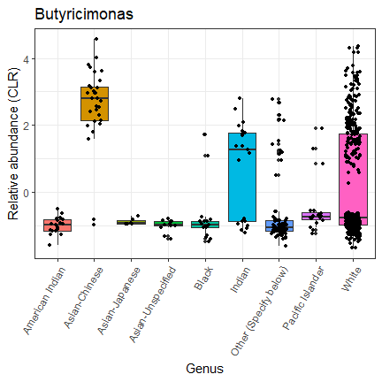

# Installing DESeq2
DESeq2 is a bioconductor package that should be installed via two main ways as follows:

#### Via bioconductor


```r
#BiocManager::install('DESeq2')
```

#### Via DESeq2 github repository


```r
library(devtools)
#install_github('mikelove/DESeq2')
```


# DESeq2 tutorials
DESeq2 is one of the important parametric methods that have been used to analyze RNA-seq data.

### Main tutorial
[Click](http://bioconductor.org/packages/devel/bioc/vignettes/DESeq2/inst/doc/DESeq2.html)

### Different workshops

* [FIrst](https://www.huber.embl.de/users/msmith/csama2019/materials/lectures/differential-expression/2019-07__CSAMA__DESeq2.pdf)

* This book is very useful
[Modern Statistics for Modern Biology](http://web.stanford.edu/class/bios221/book/index.html)

* **Phyloseq dataset**
From the same paper [Temporal and spatial variation of the human microbiota during pregnancy](https://www.pnas.org/content/112/35/11060)

# Working with DESeq2

### Dataset from stool

* **Phyloseq dataset**
From this paper [Temporal and spatial variation of the human microbiota during pregnancy](https://www.pnas.org/content/112/35/11060)


```r
da <- load("RDA/PregnancyClosed15.Rdata")
site <- "Stool"
phy <- PSPreg[[site]]
phy
```

```
phyloseq-class experiment-level object
otu_table()   OTU Table:         [ 1271 taxa and 580 samples ]
sample_data() Sample Data:       [ 580 samples by 64 sample variables ]
tax_table()   Taxonomy Table:    [ 1271 taxa by 7 taxonomic ranks ]
phy_tree()    Phylogenetic Tree: [ 1271 tips and 1270 internal nodes ]
```

**Remove rare taxa**


```
phyloseq-class experiment-level object
otu_table()   OTU Table:         [ 894 taxa and 580 samples ]
sample_data() Sample Data:       [ 580 samples by 64 sample variables ]
tax_table()   Taxonomy Table:    [ 894 taxa by 7 taxonomic ranks ]
phy_tree()    Phylogenetic Tree: [ 894 tips and 893 internal nodes ]
```
In our phyloseq dataset **taxa are columns** I shall change that, i.e. taxa are rows.
I think it might be other ways, but it works.


```r
OTU1 = as(otu_table(phy), "matrix")
if (taxa_are_rows(phy) == FALSE) {
    OTU1 <- t(OTU1)
}
OTUdf = as.data.frame(OTU1)
otu_table(phy) <- otu_table(OTUdf, taxa_are_rows = T)
identical(rownames(otu_table(phy)), rownames(tax_table(phy)))
```

```
[1] TRUE
```

## Genus level


#### DESeq2 result table

Showing the only taxa with adjusted p_value less than 0.05


|                      |   baseMean| log2FoldChange|     lfcSE|      stat|    pvalue|      padj|
|:---------------------|----------:|--------------:|---------:|---------:|---------:|---------:|
|P:TM7                 |  22.378945|      21.800010| 1.3082080| 16.664025| 0.0000000| 0.0000000|
|Catenibacterium       |  13.165041|      21.583812| 1.8157221| 11.887178| 0.0000000| 0.0000000|
|Megamonas             |  24.837902|      21.939255| 2.2458012|  9.769010| 0.0000000| 0.0000000|
|Faecalibacterium      | 204.965993|       4.013791| 0.4535050|  8.850599| 0.0000000| 0.0000000|
|Lachnospira           |  24.894486|       3.679256| 0.5590881|  6.580816| 0.0000000| 0.0000000|
|Ruminococcus          |  41.095117|       2.779825| 0.4356648|  6.380651| 0.0000000| 0.0000000|
|F:Ruminococcaceae     | 149.260135|       1.762760| 0.3403647|  5.179032| 0.0000002| 0.0000029|
|F:Clostridiaceae      |  13.889536|       3.012683| 0.5868136|  5.133970| 0.0000003| 0.0000032|
|F:[Barnesiellaceae]   |   6.767300|       4.845314| 0.9654693|  5.018611| 0.0000005| 0.0000049|
|Streptococcus         |  18.890254|       3.124087| 0.6235168|  5.010429| 0.0000005| 0.0000049|
|F:Christensenellaceae |   4.052563|       4.582075| 0.9271767|  4.941965| 0.0000008| 0.0000063|
|[Ruminococcus]        |  14.610026|      -1.935456| 0.4110902| -4.708107| 0.0000025| 0.0000188|
|Bacteroides           | 873.222633|       1.749958| 0.3908435|  4.477388| 0.0000076| 0.0000523|
|Collinsella           |   2.463040|       3.754923| 0.8519256|  4.407571| 0.0000105| 0.0000672|
|Veillonella           |   3.759663|      -4.168777| 0.9717439| -4.289996| 0.0000179| 0.0001072|
|Butyricimonas         |   1.612963|       3.232938| 0.8088162|  3.997124| 0.0000641| 0.0003607|
|Paraprevotella        |  12.076234|       4.410400| 1.1813529|  3.733347| 0.0001890| 0.0010003|
|Turicibacter          |   1.305274|       3.088718| 0.8762512|  3.524922| 0.0004236| 0.0021180|
|O:Clostridiales       |  72.068969|       1.262931| 0.3694253|  3.418636| 0.0006294| 0.0029812|
|Bifidobacterium       |   3.663781|       2.439840| 0.7226954|  3.376027| 0.0007354| 0.0033093|
|Roseburia             |  58.905956|       1.473149| 0.4477803|  3.289892| 0.0010023| 0.0042954|
|Odoribacter           |   2.835605|       1.933047| 0.6383184|  3.028342| 0.0024590| 0.0100595|
|Anaerostipes          |   1.105549|       2.261156| 0.7905448|  2.860250| 0.0042331| 0.0165642|
|O:Bacteroidales       |   8.143020|       6.212350| 2.2408686|  2.772296| 0.0055662| 0.0208734|
|Varibaculum           |   1.740448|      -2.396173| 0.9194651| -2.606051| 0.0091593| 0.0329734|


**To understand the result table, see the following notes.**

*	baseMean, is the average of the normalized count values, dividing by size factors, taken over all samples.

*	Log2FoldChange, is the effect size estimate. It tells us how much the gene's expression seems to have changed due to certain factors in the control and study groups for example. This value is reported on a logarithmic scale to base 2: for example, a log2 fold change of 1.5 means that the gene's expression is increased by a multiplicative factor of 2^1.5≈2.82.  Of course, this estimate has an uncertainty associated with it, which is available in the column lfcSE.

* lfcSE, the standard error estimate for the log2 fold change estimate

*	stat, is the Wald statistic: the log2FoldChange divided by lfcSE (the second column divided by the third), which is compared to a standard Normal distribution to generate a two-tailed pvalue. For the likelihood ratio test (LRT), stat is the difference in deviance between the reduced model and the full model, which is compared to a chi-squared distribution to generate a pvalue.

*	pvalue, the raw p-values.

*	padj, adjusted p-value.

* taxon, the genes names, or the clustered genes as in my table (Operational taxonomic unit, OTU)

#### Plot
It is showing the differentiated genes. 


```
NULL
```

# More plots

Plotting the relative abundance (CLR) for every gene in the previous table against the 'Race' variable factors. These plots are helpful to see the efficiency of DESeq2 in recognizing the differentiated genes




# DESeq2 pairwise comparison 

DESeq2 pairwise comparison analysis for the categorical variable Race factors.
I shall use "American Indian" versus "White", and we can make the same for the whole combinations of pairwise groups.


|                      |   baseMean| log2FoldChange|     lfcSE|       stat|    pvalue|      padj|
|:---------------------|----------:|--------------:|---------:|----------:|---------:|---------:|
|P:TM7                 |  22.378945|     -21.800002| 1.3082080| -16.664018| 0.0000000| 0.0000000|
|Catenibacterium       |  13.165041|     -21.583811| 1.8157221| -11.887178| 0.0000000| 0.0000000|
|Megamonas             |  24.837902|     -21.941654| 2.2458012|  -9.770078| 0.0000000| 0.0000000|
|Faecalibacterium      | 204.965993|      -4.013791| 0.4535050|  -8.850599| 0.0000000| 0.0000000|
|Lachnospira           |  24.894486|      -3.679256| 0.5590881|  -6.580816| 0.0000000| 0.0000000|
|Ruminococcus          |  41.095117|      -2.779825| 0.4356648|  -6.380651| 0.0000000| 0.0000000|
|F:Ruminococcaceae     | 149.260135|      -1.762760| 0.3403647|  -5.179032| 0.0000002| 0.0000029|
|F:Clostridiaceae      |  13.889536|      -3.012683| 0.5868136|  -5.133970| 0.0000003| 0.0000032|
|F:[Barnesiellaceae]   |   6.767300|      -4.845314| 0.9654693|  -5.018611| 0.0000005| 0.0000049|
|Streptococcus         |  18.890254|      -3.124087| 0.6235168|  -5.010429| 0.0000005| 0.0000049|
|F:Christensenellaceae |   4.052563|      -4.582075| 0.9271767|  -4.941965| 0.0000008| 0.0000063|
|[Ruminococcus]        |  14.610026|       1.935456| 0.4110902|   4.708107| 0.0000025| 0.0000188|
|Bacteroides           | 873.222633|      -1.749958| 0.3908435|  -4.477388| 0.0000076| 0.0000523|
|Collinsella           |   2.463040|      -3.754923| 0.8519256|  -4.407571| 0.0000105| 0.0000672|
|Veillonella           |   3.759663|       4.168777| 0.9717439|   4.289996| 0.0000179| 0.0001072|
|Butyricimonas         |   1.612963|      -3.232938| 0.8088162|  -3.997124| 0.0000641| 0.0003607|
|Paraprevotella        |  12.076234|      -4.410400| 1.1813529|  -3.733347| 0.0001890| 0.0010003|
|Turicibacter          |   1.305274|      -3.088718| 0.8762512|  -3.524922| 0.0004236| 0.0021180|
|O:Clostridiales       |  72.068969|      -1.262931| 0.3694253|  -3.418636| 0.0006294| 0.0029812|
|Bifidobacterium       |   3.663781|      -2.439840| 0.7226954|  -3.376027| 0.0007354| 0.0033093|
|Roseburia             |  58.905956|      -1.473149| 0.4477803|  -3.289892| 0.0010023| 0.0042954|
|Odoribacter           |   2.835605|      -1.933047| 0.6383184|  -3.028342| 0.0024590| 0.0100595|
|Anaerostipes          |   1.105549|      -2.261156| 0.7905448|  -2.860250| 0.0042331| 0.0165642|
|O:Bacteroidales       |   8.143020|      -6.212350| 2.2408686|  -2.772296| 0.0055662| 0.0208734|
|Varibaculum           |   1.740448|       2.396173| 0.9194651|   2.606051| 0.0091593| 0.0329734|


